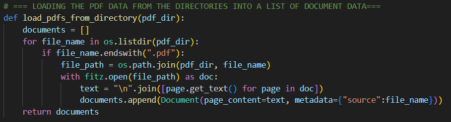

	
Note: in the below image link, for obsidian and github: "../Images/load_pdfs_from_directory.png"

../ => means going up a directory of where this current md file is located, to access the required image file through the relative path.

function format => def load_pdfs_from_directory(***pdf_dir***)