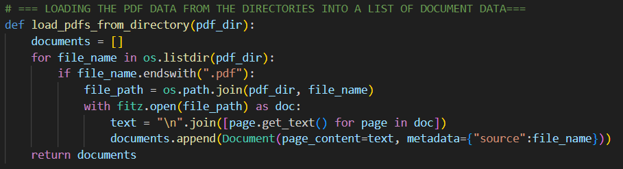

function format => def load_pdfs_from_directory(***pdf_dir***)

takes in the directory holding the pdf documents as a "str" as a parameter 

Note: in the below image link for obs and github: ../Images/load_pdfs_from_directory.png

../ => going up a directory of where this current md file is located to access the required image file through the relative path.

